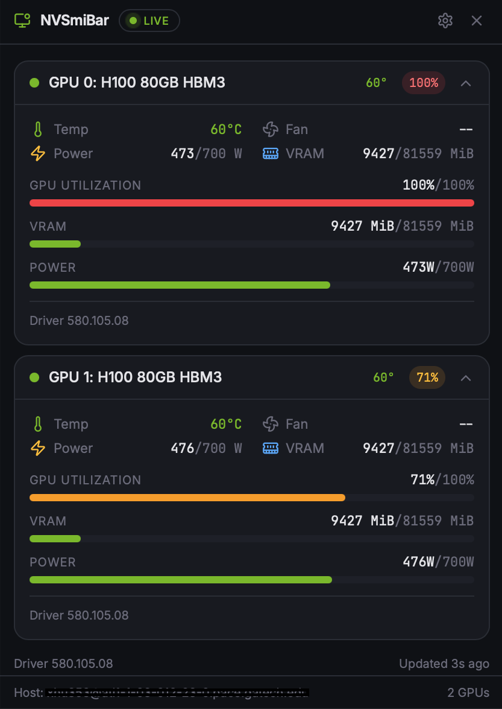
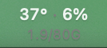
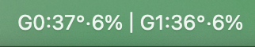

# NVSmiBar

[](https://github.com/XingyuHu109/NVSmiBar/releases)
[](https://go.dev/)
[](https://github.com/XingyuHu109/NVSmiBar#installation)


macOS menu bar app that monitors remote NVIDIA GPUs over SSH — live utilization, temperature, and VRAM every second, no terminal required.

## Preview

<p align="center">
  
</p>

<p align="center">
  
  &nbsp;&nbsp;&nbsp;
  
  <br/>
  <sub>MacOS Menu bar — Standard mode &nbsp;·&nbsp; Multi-GPU mode</sub>
</p>

## Installation

**Homebrew (Recommended):**

```bash
brew install --cask XingyuHu109/tap/nvsmibar
```


<details>
<summary>Manual DMG Installation:</summary>

1. Download **[NVSmiBar.dmg](https://github.com/XingyuHu109/NVSmiBar/releases/latest/download/NVSmiBar.dmg)** (Apple Silicon, macOS 12+)
2. Drag **NVSmiBar.app** to Applications and launch it
3. If macOS shows _"Apple could not verify…"_, go to **System Settings → Privacy & Security → Open Anyway**
</details>

After installation:

- Click the **GPU** label in the menu bar to open the mini popup
- Use **Open dashboard** to add/manage SSH connections and import aliases from `~/.ssh/config`
> Requires SSH key-based auth to your GPU server and `nvidia-smi` on the remote machine.

## Features

- Menu bar only — no Dock icon
- Two UX modes: mini popup for quick glance + full dashboard for connection management
- Saved SSH connection profiles (duplicates allowed) with quick switch in mini popup
- SSH config alias import (`~/.ssh/config` + `Include` files)
- Polls `nvidia-smi` every second via SSH with stale-data retention + auto-retry backoff
- Per-GPU util/temp/VRAM plus fan/power/driver/CUDA when available
- Menu bar display modes: minimal, compact, standard, spark, multi-GPU

## Build from Source

```bash
go install github.com/wailsapp/wails/v2/cmd/wails@v2.11.0
git clone https://github.com/XingyuHu109/NVSmiBar.git && cd NVSmiBar
wails build && open build/bin/NVSmiBar.app
```

Requires Go 1.21+, Node 18+.

## Stack

[Wails v2](https://wails.io) · Native NSStatusItem (CGo) · React + TypeScript + Tailwind

## License

MIT
